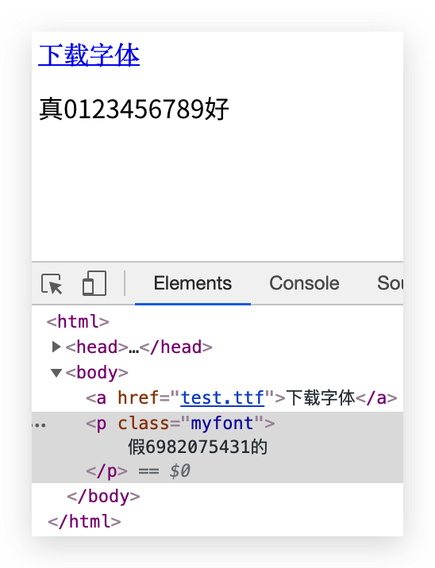
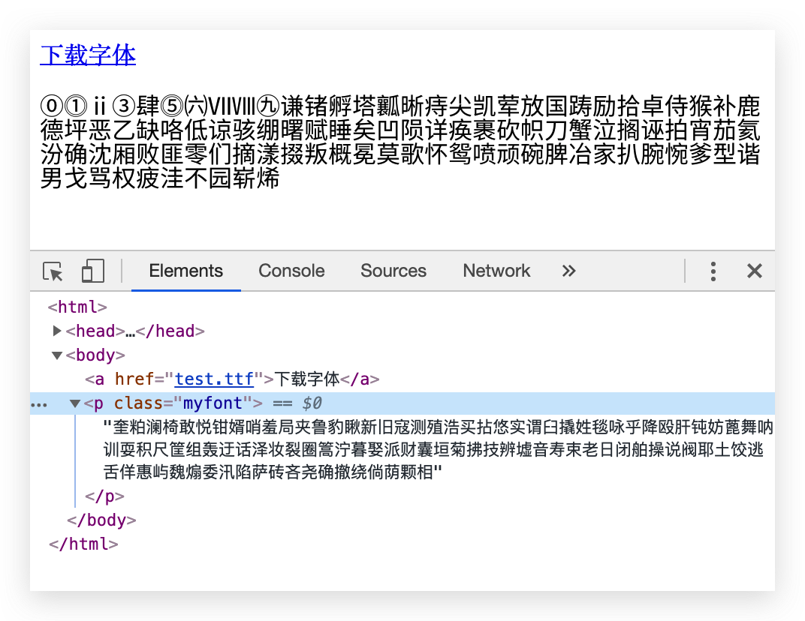

# fontObfuscator

## 简介

利用 `fontTools` 包，可以混淆英文，数字以及大部分CJK字符。

制作出的字体可以用于反爬虫、保护隐私信息。

支持生成本地字体文件、base64内容，也可以上传到阿里云oss。

如需使用阿里云oss，请修改 `config.py`。




由于`Sanic`框架使用到了`uvloop`，windows用户请参考这个链接： https://github.com/huge-success/sanic#installation


## 测试

建议先新建一个python venv

```shell script
python3 -m venv venv
```

```shell script
pip install -r requirements.txt
python3 run test.py
```

然后打开 `test/demo.html` 即可体验效果。


## API

如果需要上传到阿里云oss，请将`upload`设置为`true`。


### 普通混淆（明文+阴书）

```shell script
curl -X POST \
  http://127.0.0.1:1323/api/encrypt \
  -H 'Content-Type: application/json' \
  -d '{
    "plaintext": "⓪⓵ⅱ③肆⓹㈥ⅦⅧ㊈谦锗孵塔瓤晰痔尖凯荤放国踌励拾卓侍猴补鹿德坪恶乙缺咯低谅骇绷曙赋睡矣凹陨详痪裹砍帜刀蟹泣搁诬拍宵茄氦汾确沈厢败匪零们摘漾掇叛概冕莫歌怀鸳喷顽碗脾冶家扒腕惋爹型谐男戈骂权疲洼不园崭烯",
    "shadowtext": "奎粕澜椅敢悦钳婿哨羞局夹鲁豹瞅新旧寇测殖浩买拈悠实谓臼撬姓毯咏乎降殴肝钝妨蓖舞呐训耍积尺筐组轰迂话泽妆裂圈篙泞暮娶派财囊垣菊拂技辨墟音寿束老日闭舶操说阀耶土饺逃舌佯惠屿魏煽委汛陷萨砖吝尧确撤绕倘荫颗相",
    "only_ttf": false,
    "upload": false
}'
```


### 加强混淆（混淆name ）

```shell script
curl -X POST \
  http://127.0.0.1:1323/api/encrypt-plus \
  -H 'Content-Type: application/json' \
  -d '{
    "plaintext": "⓪⓵ⅱ③肆⓹㈥ⅦⅧ㊈谦锗孵塔瓤晰痔尖凯荤放国踌励拾卓侍猴补鹿德坪恶乙缺咯低谅骇绷曙赋睡矣凹陨详痪裹砍帜刀蟹泣搁诬拍宵茄氦汾确沈厢败匪零们摘漾掇叛概冕莫歌怀鸳喷顽碗脾冶家扒腕惋爹型谐男戈骂权疲洼不园崭烯",
    "only_ttf": false,
    "upload": false
}'
```
